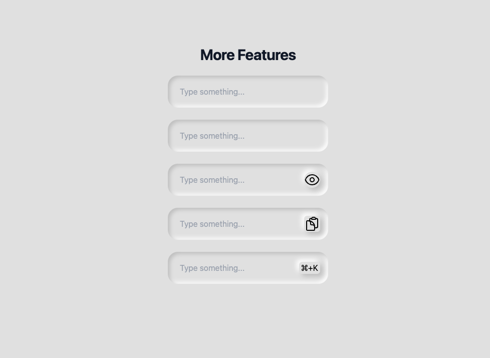

<div align="center">
  <h3 text-align="center">
    Composition Pattern in React
  </h3>
  <p align="center">
    <a href="https://friedrith.github.io/react-composition">Demo</a> | <a href="https://friedrith.github.io/react-composition/slides">Slides</a>
  </p>

  
</div>

This is a demo project to show how to use composition pattern in React. It is part of a speech at the [React & React Native MTL Monthly Meetup](https://www.meetup.com/react-mtl/events/294497412/) of November 2023.

## Getting started

```bash
pnpm install
pnpm dev

```

## License

Distributed under the MIT License. See [LICENSE](./LICENSE) for more information.

## Acknowledgements

- [React](https://reactjs.org/)
- [Tailwind](https://tailwindcss.com/)
- [Headless UI](https://headlessui.dev/)
- [Github Actions](https://github.com/features/actions)
- [Neumorphism](https://neumorphism.io)
- [cloneElement](https://react.dev/reference/react/cloneElement)
